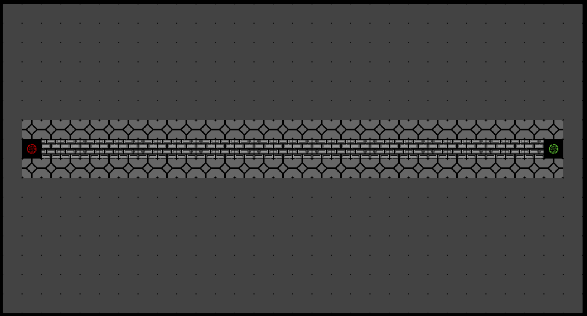
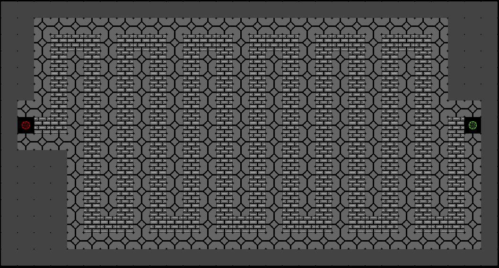
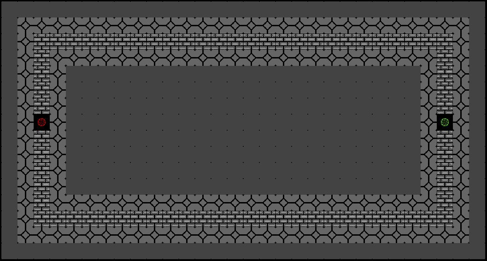
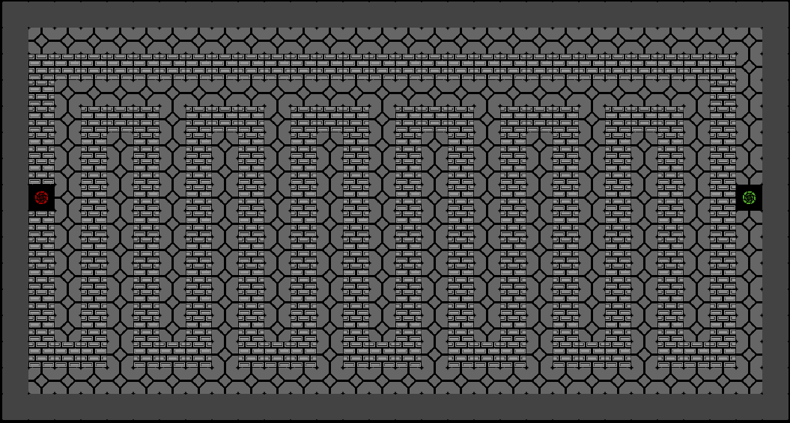
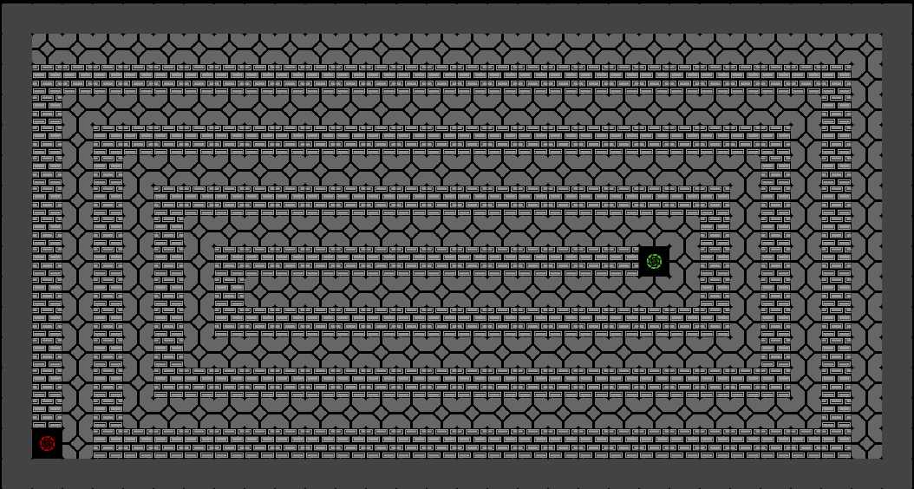

# Chikwangue Spot

## Project Introduction

Welcome to the thrilling world of Chikwangue Mystery, a tower defense game where each session is a unique adventure. Get ready to defend your territories against waves of invaders using a variety of towers and strategies. With multiple maps and enemies, each game presents new challenges to conquer.

## Project Stack

This project was developed using the following technologies:
- **Java**: Programming language for the game logic.
- **Java Swing**: Graphical library for the user interface.

## Project Features

### Maps:
The game features 5 distinct maps, each offering its own challenges and strategies.

### Towers:
There are 11 types of towers available in the game, each with its unique characteristics:
- **Basic Tower**: Standard attack, quick and effective against basic enemies.

- **Canon Tower**: High area damage, perfect for groups of enemies.

- **Chikwangue Tower**: Powerful all-rounder tower with special effects.

- **Frozen Tower**: Slows enemies down with a freezing effect.

- **Heat Tower**: Inflicts burn damage over time.

- **MiniGun Tower**: High rate of fire for a bullet hailstorm.

- **Missile Tower**: For precise and powerful long-range strikes.

- **Opinel Tower**: Balanced with good range and damage.

- **Poison Tower**: Poisons enemies, dealing damage over time.

- **Sniper Tower**: Excellent for taking out high-priority targets at a distance.

- **Tesla Tower**: Combines freezing effects with electrical damage.

### Enemies:
Fight against 14 different enemy types, each with their own strengths and weaknesses:
- **Arrow**: Fast and agile, hard to hit.

- **Chikwangon**: A robust tank capable of absorbing a lot of damage.

- **Chillagon**: Slow but resistant, it does not take freeze damage.

- **Circle**: Moderate speed and resistance, a balanced enemy.

- **Cross**: An aerial threat that can dodge basic attacks.

- **Heart**: Quite resilient and capable of regenerating its health.

- **Kite**: Fast and nimble, can dodge slow attacks.

- **Octagon**: Heavily armored and resistant to physical attacks.

- **Pentagon**: Medium speed with good resistance to magical damage.

- **Rhombus**: Agile with a decent resistance to physical and magical attacks.

- **Square**: Low speed and health, but quick to spawn.

- **Star**: Resilient to most types of damage and can deal damage to towers.

- **Trapeze**: Quick and with a true damage effect, difficult for unprepared defenses.

- **Triangle**: Can rapidly change direction, making it unpredictable.
